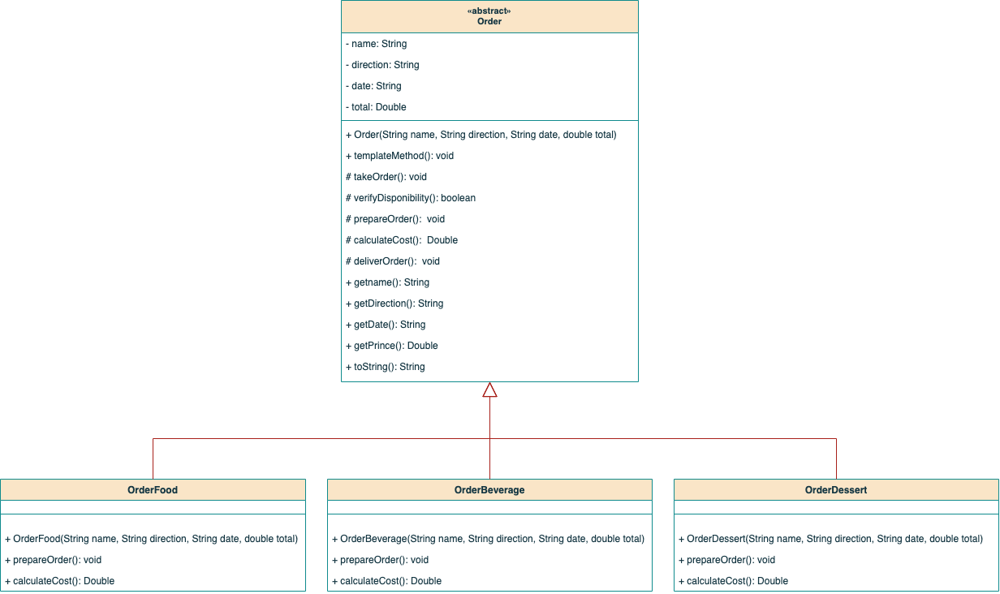

# Patrón de Diseño para sistema de gestión de restaurantes

El patron de diseño seleccionado para cubrir las necesidades del problema: Template Method

## Justificación

Se eligió este patrón de diseño de comportamiento para el problema de gestión de restaurantes, debido a que este define el esqueleto de un algoritmo en una clase padre (procesamiento de órdenes) y permite que sus clases hijas puedan sobreescribir código sin alterar su estructura (pasos específicos según el tipo de pedido).

Esto evita la duplicación de código y la mala práctica de tener un exceso de condicionales, fomentando el uso de polimorfismo.

## UML

Como se puede observar en el diagrama anterior, la clase abstracta Order define una estructura común para el procesamiento de órdenes, donde establece unos atributos y métodos enfocados en la toma del pedido, la preparación, la verificación de disponibilidad, el total del pedido, entre otros. 

De igual forma, se cuenta con clases que extienden de Order y que representan los tres tipos de pedidos que se manejan hasta el momento, las cuales son capaces de especificar sus propios comportamientos en ciertos métodos heredados como son la de preparar la orden y calcular el total del pedido.