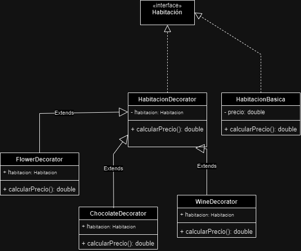

# Patrones de Diseño

## Integrantes
+ Juan David Cetina Gomez
+ Juliana Isabel Espinel Cortes
+ Ana Lucia Quintero Vargas

## Objetivo
Identificar un patrón de diseño que solucione los problemas presentados en cada punto y codificar la solución del ejercicio junto con su diagrama de clases (UML).

Por medio de las carpetas que van del punto 1 al 5, se pueden encontrar los códigos del ejercicio junto con sus respectivos diagramas de clases, que fueron diseñados a partir del tipo de patrón de diseño seleccionado para cubrir las necesidades de sus problemas.

# Solución punto 1

## Patrón de Diseño para sistema de gestión de la decoración de habitaciones en el hotel

## Justificación

## UML

# Solución punto 2

## Patrón de Diseño para sistema de gestión de la decoración de habitaciones en el hotel

## Justificación

## UML

# Solución punto 3

## Patrón de Diseño para sistema de gestión de restaurantes

El patron de diseño seleccionado para cubrir las necesidades del problema: Template Method

## Justificación

Se eligió este patrón de diseño de comportamiento para el problema de gestión de restaurantes, debido a que este define el esqueleto de un algoritmo en una clase padre (procesamiento de órdenes) y permite que sus clases hijas puedan sobreescribir código sin alterar su estructura (pasos específicos según el tipo de pedido).

Esto evita la duplicación de código y la mala práctica de tener un exceso de condicionales, fomentando el uso de polimorfismo.

## UML

Como se puede observar en el diagrama anterior, la clase abstracta punto3.Order define una estructura común para el procesamiento de órdenes, donde establece unos atributos y métodos enfocados en la toma del pedido, la preparación, la verificación de disponibilidad, el total del pedido, entre otros.

De igual forma, se cuenta con clases que extienden de punto3.Order y que representan los tres tipos de pedidos que se manejan hasta el momento, las cuales son capaces de especificar sus propios comportamientos en ciertos métodos heredados como son la de verificar disponibilidad, preparar la orden y calcular el total del pedido.

# Solución punto 4

## Patrón de Diseño para sistema de gestión de la decoración de habitaciones en el hotel

## Justificación

## UML

# Solución punto 5

## Patrón de Diseño para sistema de gestión de la decoración de habitaciones en el hotel
El patrón de diseño que se escogió fue un patrón estructural denominado : "Decorator" 

## Justificación 
Se escogió el patrón de "Decorator" puesto que proporciona una manera flexible y dinámica de agregar funcionalidades adicionales a objetos existentes sin necesidad de modificar su estructura original. 

Este patrón permite separar la responsabilidad de cada mejora o adición que se le agregue a alguna habitación en clases diferentes, manteniendo cada decorador enfocado en una única responsabilidad. 

Si en el futuro se quisiera agregar más mejoras como una cena romántica o un servicio de spa, se pueden crear nuevos decoradores sin necesidad de modificar las clases que ya existen, lo que sigue el principio Open/Closed, donde las clases están abiertas a extensión pero cerradas a modificación.

## UML

