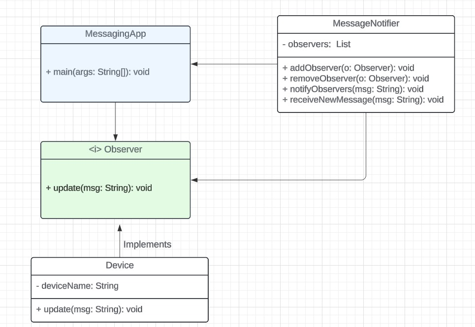

# Patrones de Diseño

## Integrantes
+ Juan David Cetina Gomez
+ Juliana Isabel Espinel Cortes
+ Ana Lucia Quintero Vargas

## Objetivo
Identificar un patrón de diseño que solucione los problemas presentados en cada punto y codificar la solución del ejercicio junto con su diagrama de clases (UML).

Por medio de las carpetas que van del punto 1 al 5, se pueden encontrar los códigos del ejercicio junto con sus respectivos diagramas de clases, que fueron diseñados a partir del tipo de patrón de diseño seleccionado para cubrir las necesidades de sus problemas.

# Solución punto 1

## Patrón de Diseño para sistema de gestión de la decoración de habitaciones en el hotel

## Justificación

## UML

# Solución punto 2

## Patrón de Diseño para una App de mensajería en tiempo real

El patrón de diseño seleccionado para cubrir las necesidades del problema: Observer (Patrón de comportamiento)

## Justificación

Este patrón de diseño fue seleccionado debido a que permite definir un mecanismo de suscripción para notificar a varios objetos sobre cualquier evento que le suceda al objeto que están observando, para este caso, cada vez que un usuario recibe un nuevo mensaje, todos los dispositivos del usuario deben ser notificados para que el mensaje se muestre en cada uno de ellos, por lo que, los dispositivos serían los observadores. Además de esto, gracias al patrón Observer, es posible realizar modificaciones a los dispositivos del usuario sin afectar la lógica principal de la App, garantizando flexibilidad y es posible que exista desacoplamiento en la App, ya que, solo es necesario el nombre del dispositivo para simular la notificación en cada uno de estos.

## UML
.

Como se evidencia en el diagrama de clases, la interfaz observer envía el método update a las clases y es implementado por Device. Lo que demuestra que el patrón de diseño Observer se adecúa bastante bien frente a la aplicación de mensajería en tiempo real.

# Solución punto 3

## Patrón de Diseño para sistema de gestión de restaurantes

El patrón de diseño seleccionado para cubrir las necesidades del problema es "Template Method".

## Justificación

Se eligió este patrón de diseño de comportamiento para el problema de gestión de restaurantes, debido a que este define el esqueleto de un algoritmo en una clase padre (procesamiento de órdenes) y permite que sus clases hijas puedan sobreescribir código sin alterar su estructura (pasos específicos según el tipo de pedido).

Esto evita la duplicación de código y la mala práctica de tener un exceso de condicionales, fomentando el uso de polimorfismo.

## UML

Como se puede observar en el diagrama anterior, la clase abstracta punto3.Order define una estructura común para el procesamiento de órdenes, donde establece unos atributos y métodos enfocados en la toma del pedido, la preparación, la verificación de disponibilidad, el total del pedido, entre otros.

De igual forma, se cuenta con clases que extienden de punto3.Order y que representan los tres tipos de pedidos que se manejan hasta el momento, las cuales son capaces de especificar sus propios comportamientos en ciertos métodos heredados como son la de verificar disponibilidad, preparar la orden y calcular el total del pedido.

# Solución punto 4

# Patrón de diseño para sistema de gestión de tareas

El patrón de diseño seleccionado para cubrir las necesidades del problema es "Command".

## Justificación

Se ve adecuado implementar este patrón de diseño de comportamiento, ya que permite encapsular las acciones de comandos como crear, editar, completar y eliminar una tarea en objetos separados. Esto hace que se pueda trabajar con un intermediario que separa las acciones que los usuarios quieren realizar con la forma en que se ejecutan por detrás. De igual forma, facilita implementar operaciones de reversión y se está abierto a la expensión de nuevas funciones que se deseen incluir en el futuro sin la necesidad de modificar el código existente.

## UML

Como se vislumbra en el diagrama de clases, se puede observar la clase abstracta Command que se encarga de declarar un método execute() para ejecutar la operación que le indique el usuario desde la clase User, que actua como el Invoker, que mantiene una referencia a un objeto Command y lo ejecuta. A partir de Command se pueden extender comandos concretos como el de crear, editar, completar y eliminar tareas. Asimismo, esta clase abstracta se encuentra asociada a la clase TaskOperation, que es la que tiene la lógica de negocio para saber cómo realizar las operaciones sobre una tarea.

# Solución punto 5

## Patrón de Diseño para sistema de gestión de la decoración de habitaciones en el hotel
El patrón de diseño que se escogió fue un patrón estructural denominado "Decorator" 

## Justificación 
Se escogió el patrón de "Decorator" puesto que proporciona una manera flexible y dinámica de agregar funcionalidades adicionales a objetos existentes sin necesidad de modificar su estructura original. 

Este patrón permite separar la responsabilidad de cada mejora o adición que se le agregue a alguna habitación en clases diferentes, manteniendo cada decorador enfocado en una única responsabilidad. 

Si en el futuro se quisiera agregar más mejoras como una cena romántica o un servicio de spa, se pueden crear nuevos decoradores sin necesidad de modificar las clases que ya existen, lo que sigue el principio Open/Closed, donde las clases están abiertas a extensión pero cerradas a modificación.

## UML

